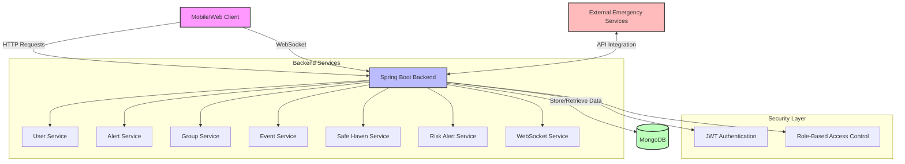

You can use this Mermaid diagram in your presentation by:
1. Installing the Mermaid extension in your presentation tool
2. Or converting it to an image using the Mermaid Live Editor (https://mermaid.live/)
3. Or recreating it using PowerPoint shapes and connectors