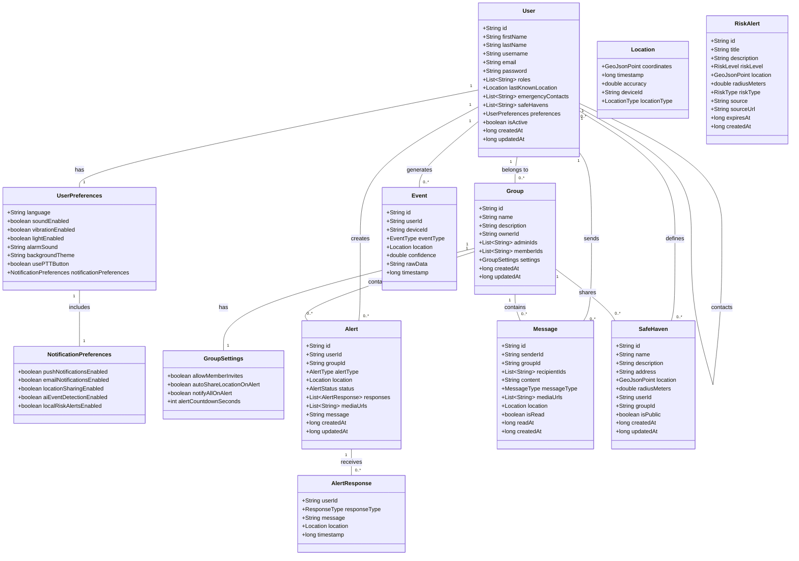

```mermaid
classDiagram
    class User {
        +String id
        +String firstName
        +String lastName
        +String username
        +String email
        +String password
        +List~String~ roles
        +Location lastKnownLocation
        +List~String~ emergencyContacts
        +List~String~ safeHavens
        +UserPreferences preferences
        +boolean isActive
        +long createdAt
        +long updatedAt
    }

    class UserPreferences {
        +String language
        +boolean soundEnabled
        +boolean vibrationEnabled
        +boolean lightEnabled
        +String alarmSound
        +String backgroundTheme
        +boolean usePTTButton
        +NotificationPreferences notificationPreferences
    }

    class NotificationPreferences {
        +boolean pushNotificationsEnabled
        +boolean emailNotificationsEnabled
        +boolean locationSharingEnabled
        +boolean aiEventDetectionEnabled
        +boolean localRiskAlertsEnabled
    }

    class Group {
        +String id
        +String name
        +String description
        +String ownerId
        +List~String~ adminIds
        +List~String~ memberIds
        +GroupSettings settings
        +long createdAt
        +long updatedAt
    }

    class GroupSettings {
        +boolean allowMemberInvites
        +boolean autoShareLocationOnAlert
        +boolean notifyAllOnAlert
        +int alertCountdownSeconds
    }

    class Alert {
        +String id
        +String userId
        +String groupId
        +AlertType alertType
        +Location location
        +AlertStatus status
        +List~AlertResponse~ responses
        +List~String~ mediaUrls
        +String message
        +long createdAt
        +long updatedAt
    }

    class AlertResponse {
        +String userId
        +ResponseType responseType
        +String message
        +Location location
        +long timestamp
    }

    class Location {
        +GeoJsonPoint coordinates
        +long timestamp
        +double accuracy
        +String deviceId
        +LocationType locationType
    }

    class Message {
        +String id
        +String senderId
        +String groupId
        +List~String~ recipientIds
        +String content
        +MessageType messageType
        +List~String~ mediaUrls
        +Location location
        +boolean isRead
        +long readAt
        +long createdAt
    }

    class Event {
        +String id
        +String userId
        +String deviceId
        +EventType eventType
        +Location location
        +double confidence
        +String rawData
        +long timestamp
    }

    class SafeHaven {
        +String id
        +String name
        +String description
        +String address
        +GeoJsonPoint location
        +double radiusMeters
        +String userId
        +String groupId
        +boolean isPublic
        +long createdAt
        +long updatedAt
    }

    class RiskAlert {
        +String id
        +String title
        +String description
        +RiskLevel riskLevel
        +GeoJsonPoint location
        +double radiusMeters
        +RiskType riskType
        +String source
        +String sourceUrl
        +long expiresAt
        +long createdAt
    }

    %% Relationships
    User "1" -- "0..*" Group : belongs to
    User "1" -- "0..*" Alert : creates
    User "1" -- "0..*" Message : sends
    User "1" -- "0..*" Event : generates
    User "1" -- "0..*" SafeHaven : defines
    Group "1" -- "0..*" Alert : contains
    Group "1" -- "0..*" Message : contains
    Group "1" -- "0..*" SafeHaven : shares
    Alert "1" -- "0..*" AlertResponse : receives
    User "1" -- "1" UserPreferences : has
    UserPreferences "1" -- "1" NotificationPreferences : includes
    Group "1" -- "1" GroupSettings : has
    User "1" -- "0..*" User : contacts
```
