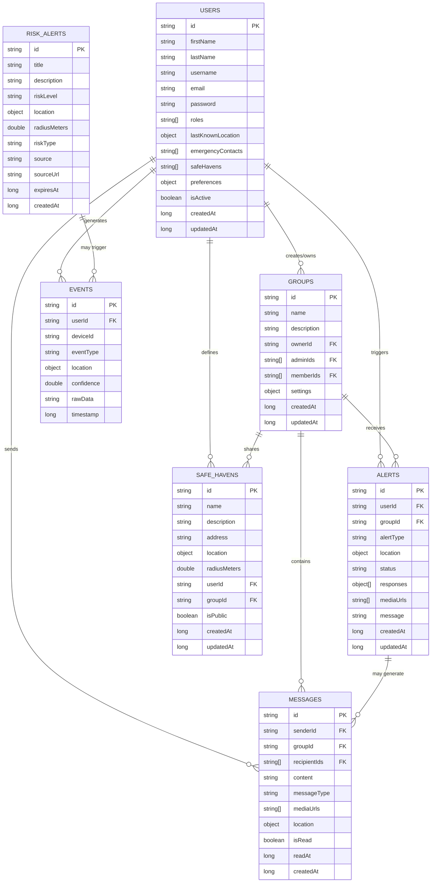

```mermaid
erDiagram
    USERS {
        string id PK
        string firstName
        string lastName
        string username
        string email
        string password
        string[] roles
        object lastKnownLocation
        string[] emergencyContacts
        string[] safeHavens
        object preferences
        boolean isActive
        long createdAt
        long updatedAt
    }

    GROUPS {
        string id PK
        string name
        string description
        string ownerId FK
        string[] adminIds FK
        string[] memberIds FK
        object settings
        long createdAt
        long updatedAt
    }

    ALERTS {
        string id PK
        string userId FK
        string groupId FK
        string alertType
        object location
        string status
        object[] responses
        string[] mediaUrls
        string message
        long createdAt
        long updatedAt
    }

    MESSAGES {
        string id PK
        string senderId FK
        string groupId FK
        string[] recipientIds FK
        string content
        string messageType
        string[] mediaUrls
        object location
        boolean isRead
        long readAt
        long createdAt
    }

    EVENTS {
        string id PK
        string userId FK
        string deviceId
        string eventType
        object location
        double confidence
        string rawData
        long timestamp
    }

    SAFE_HAVENS {
        string id PK
        string name
        string description
        string address
        object location
        double radiusMeters
        string userId FK
        string groupId FK
        boolean isPublic
        long createdAt
        long updatedAt
    }

    RISK_ALERTS {
        string id PK
        string title
        string description
        string riskLevel
        object location
        double radiusMeters
        string riskType
        string source
        string sourceUrl
        long expiresAt
        long createdAt
    }

    USERS ||--o{ GROUPS : "creates/owns"
    USERS ||--o{ ALERTS : "triggers"
    USERS ||--o{ MESSAGES : "sends"
    USERS ||--o{ EVENTS : "generates"
    USERS ||--o{ SAFE_HAVENS : "defines"

    GROUPS ||--o{ ALERTS : "receives"
    GROUPS ||--o{ MESSAGES : "contains"
    GROUPS ||--o{ SAFE_HAVENS : "shares"

    ALERTS ||--o{ MESSAGES : "may generate"
    RISK_ALERTS ||--o{ EVENTS : "may trigger"
```
